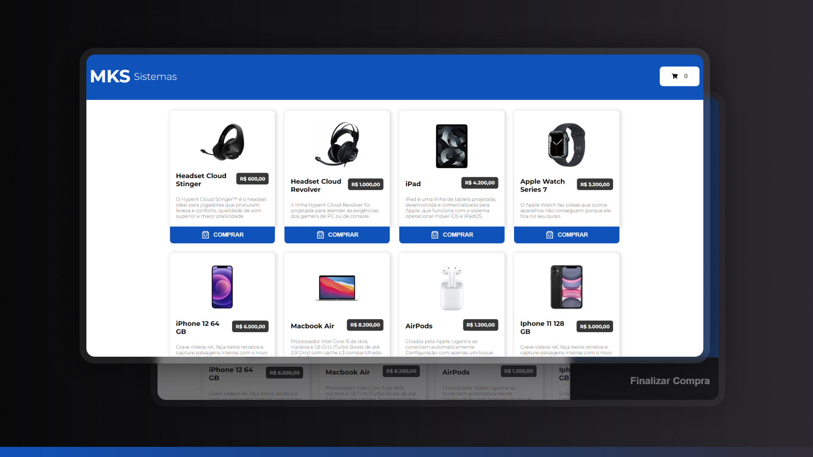

## 🚀 MKS Sistemas

Este projeto foi desenvolvido como parte de um desafio para consumir uma API REST de produtos e exibir uma lista de produtos de uma loja, bem como gerenciar um carrinho de compras.

### Descrição

Este projeto é uma aplicação web de uma loja de eletrônicos, onde os usuários podem visualizar produtos e adicioná-los a um carrinho de compras. A aplicação foi desenvolvida utilizando React e Vite, com Styled-components para a estilização, Skeleton para loading, e react-icons para ícones. O gerenciamento do estado do carrinho é feito através de um Context e Provider.

## 💻 Tecnologias Utilizadas

- **React + Vite**
- **Styled-components**
- **Skeleton (para loading)**
- **React-icons**
- **Sonner**
- **Git (para versionamento)**

### Funcionalidades

**Loja:** Lista de produtos buscada de uma API REST.
Exibe um Skeleton enquanto os produtos estão carregando.
**Carrinho:** Contém todos os produtos selecionados.
Permite aumentar ou diminuir a quantidade de cada produto.

### Estrutura do Projeto

`src`
* `components`: Componentes reutilizáveis da aplicação.
* `contexts`: Context e Provider para gerenciamento de estado.
* `pages`: Páginas da aplicação (Loja e Carrinho).
* `routes`: Definição de rotas.
* `styles`: Estilos globais e temas.
* `utils`: Funções utilitárias (converção de moeda).


## 💻 Instalação

Siga estas etapas para configurar e executar o projeto:

**1. Clone este repositório:**

```bash
git clone https://github.com/marciiosouza/mks-sistemas.git
```

**2. Acesse o diretório do projeto:**

```bash
cd mks-sistemas
```

**3. Instale as dependências:**

```bash
npm install
```

## 👨🏽‍💻 Como usar

Para iniciar o servidor de desenvolvimento, execute o seguinte comando:

```bash
npm run dev
```

Isso iniciará o servidor e você poderá acessar o aplicativo no navegador em http://localhost:5173/

## 🌐 Deploy
A aplicação está hospedada e pode ser acessada através do seguinte link:

[[Link do Deploy](https://mks-sistemas-pi.vercel.app/)]

## ⚙️ API
A aplicação consome uma API REST de produtos para exibir a lista de produtos. 
A documentação da API pode ser encontrada [https://mks-frontend-challenge-04811e8151e6.herokuapp.com/api-docs/].
